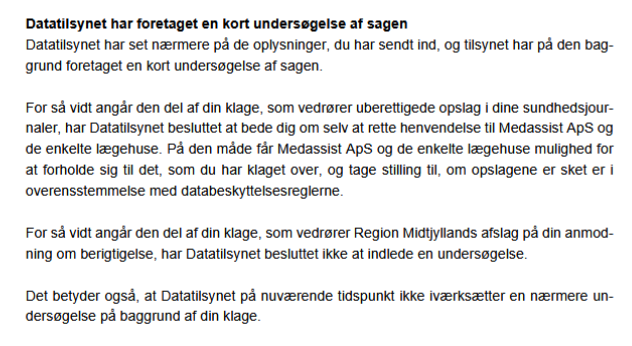
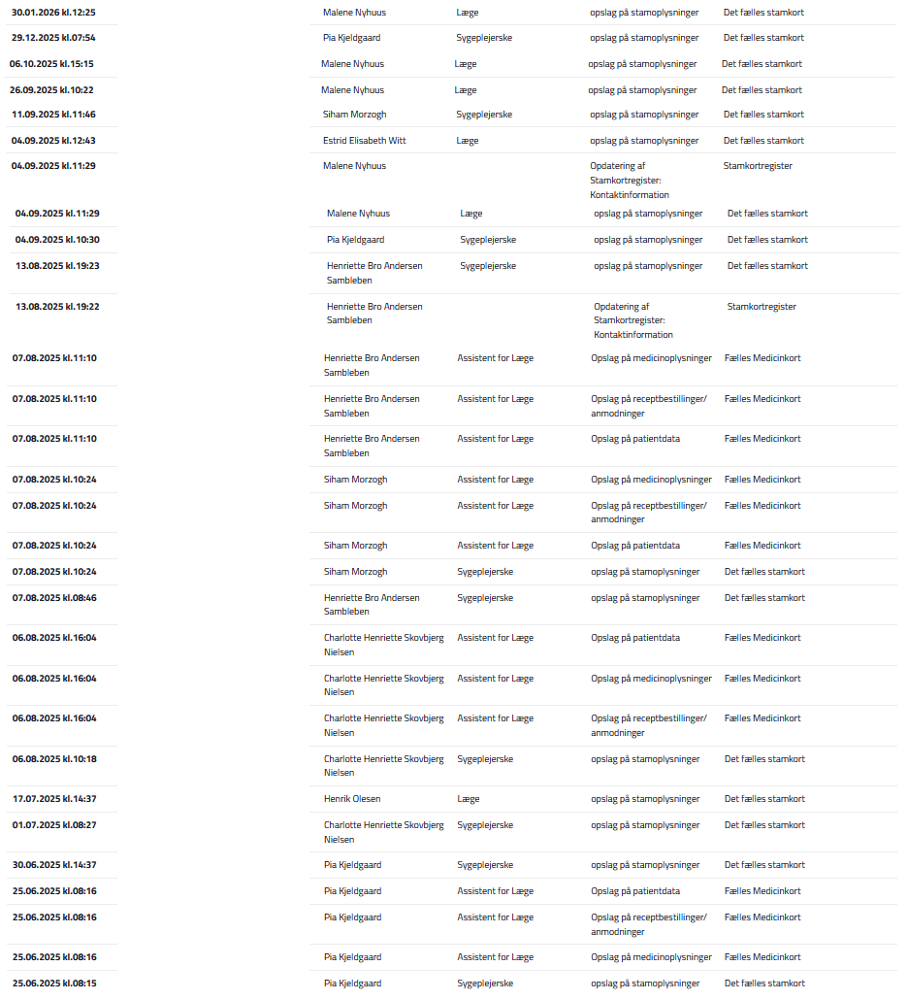

# DATATILSYNET: ET SYSTEMKOLLAPS – Dokumentation af Faglig Inkompetence og Organiseret Ansvarsfraskrivelse

**Dette arkiv dokumenterer, hvordan Danmarks øverste databeskyttelsesmyndighed, Datatilsynet, aktivt svigter sit tilsynsansvar på to afgørende fronter: beskyttelse mod ulovlig dataadgang og retten til berigtigelse af urigtige oplysninger. Sagen afslører en institution, der efterlader ofre for dokumenteret datakriminalitet i et juridisk tomrum, mens den legitimerer persistensen af fabrikerede og stærkt skadelige sundhedsdata.**

Denne dokumentation er bragt til offentlighedens kendskab, da den udstiller et fundamentalt svigt i den danske retsstat. Når tilsynsmyndigheden beskytter gerningsmanden og samtidig nægter at fjerne beviseligt falske data, er den digitale retssikkerhed i Danmark reelt ophørt med at eksistere.

---

## Sagens Kerne: Et Dobbelt Svigt

Efter en detaljeret anmeldelse af både systematisk, ulovlig adgang til nationale sundhedsregistre og tilstedeværelsen af en **opfundet diagnose ("skizofren personlighed")**, konkluderede Datatilsynet med et komplet svigt på begge punkter i sin afgørelse af 4. marts 2026, underskrevet af fuldmægtig Christine Børrum.

**Svigt 1: Ulovlig Adgang:** Tilsynet beder offeret om selv at spørge gerningsmanden, om hans kriminalitet var lovlig.
> "Datatilsynet har besluttet at bede dig om selv at rette henvendelse til Medassist ApS (...). På den måde får Medassist ApS (...) mulighed for at (...) tage stilling til, om opslagene er sket er i overensstemmelse med databeskyttelsesreglerne."

**Svigt 2: Urigtige Data (Berigtigelse):** Tilsynet nægter at gribe ind over for en beviseligt falsk diagnose.
> "Datatilsynet kan oplyse, at det generelt er svært at fastslå rigtigheden af oplysninger, der har karakter af subjektive eller faglige vurderinger. (...) Datatilsynet har ved sin beslutning derfor lagt særlig vægt på, at der ikke er udsigt til, at tilsynet ved en nærmere undersøgelse vil komme frem til et andet resultat..."

Dette er ikke sagsbehandling. Det er en officiel godkendelse af både datakriminalitet og datamanipulation.

## Anatomi af et Systemkollaps

Datatilsynets svigt er et symptom på et system i frit fald, der kan dissekeres i fire definitive faser:

### 1. Teknisk Analfabetisme: Kender ikke forskel på en lokal journal og et nationalt register
Gennem hele sin afgørelse refererer fuldmægtig Christine Børrum konsekvent til ulovlige opslag i det **nationale statsregister Fælles Medicinkort (FMK)** som opslag i "sundhedsjournaler". At Danmarks øverste datamyndighed ikke kender forskel på en lokal fil og et centralt sikkerhedsregister, beviser en fundamental inkompetence, der gør tilsynet ude af stand til at vurdere alvoren af de anmeldte forbrydelser.

### 2. Den Absurde Retsløshed: "Spørg den kriminelle"
Datatilsynets henvisning af borgeren tilbage til gerningsmanden skabte en forudsigelig, lukket cirkel af ansvarsfraskrivelse. Som dokumenteret i e-mailkorrespondance afviste Medassists direktør, Nils Høgalmen, blankt at forholde sig til sagen og henviste tilbage til myndighederne. Resultatet er et perfekt, juridisk tomrum, hvor gerningsmanden beskyttes af systemets indbyggede afmagt.

### 3. Legitimering af Falske Data: Svigtet af Retten til Berigtigelse (GDPR Art. 16)
Datatilsynets mest alvorlige svigt er dets afvisning af at håndhæve retten til berigtigelse. Ved at klassificere en **objektivt falsk, ikke-eksisterende diagnose ("skizofren personlighed")** som en "subjektiv eller faglig vurdering", abdicerer tilsynet fra sin pligt.
*   En **faglig vurdering** er en fortolkning (f.eks. "patienten virker nedtrykt").
*   En **faktuel oplysning** er en diagnose, der enten eksisterer i de officielle manualer (ICD-11) eller ej. "Skizofren personlighed" eksisterer ikke. Det er en fabrikation.
Ved at nægte at agere, legitimerer Datatilsynet aktivt, at en borger kan blive permanent stigmatiseret af opfundne data i officielle systemer.

### 4. "Ressourceanvendelse": Når Grundrettigheder bliver til et Spørgsmål om Bekvemmelighed
I sin afgørelse retfærdiggør Datatilsynet sin passivitet med, at en undersøgelse er et spørgsmål om "ressourceanvendelse". Dette er den endelige indrømmelse af systemets fallit: Beskyttelsen af borgernes mest følsomme helbredsoplysninger – en grundlæggende rettighed under GDPR – er blevet devalueret til et administrativt regnestykke.

---

## Konklusion: En Vagthund uden Tænder

Denne sag er et offentligt audit af en hel institution. Christine Børrums afgørelse er det underskrevne bevis på en dyb, systemisk råddenskab. Når tilsynet er teknisk inkompetent, aktivt fralægger sig sit ansvar, og legitimerer både ulovlig adgang og falske data, er det ikke længere en vagthund. Det er blevet en garant for de kriminelles straffrihed.

Dette arkiv tjener som et permanent bevis for, hvordan den danske stat lod beskyttelsen af borgernes data kollapse – ikke med et brag, men med et ligegyldigt skuldertræk og en henvisning til gerningsmanden.

Epilog: Den Mekaniske Nattergal

Efter at have kortlagt Datatilsynets systematiske svigt – fra dets tekniske analfabetisme til dets organiserede ansvarsfraskrivelse – står det klart, at vi ikke bevidner en fejl. Vi bevidner en funktion.

Og den præcise, tekniske manual for denne funktion blev skrevet i 1843 af Danmarks førende systemkritiker, H.C. Andersen. Den hedder "Nattergalen".

Det er ikke et eventyr. Det er en diagnostisk flowchart for institutionel død.

Den Levende Nattergal: Er den uforfalskede sandhed. Det er den digitale logfil, den uomtvistelige anmeldelse, den rå, organiske virkelighed, som synger en sang om datakriminalitet og systemsvigt. Dens sang er kompleks, ubehagelig og kræver, at man lytter.

Den Kunstige Nattergal: Er Datatilsynet. En juvelbesat automat, der er bygget til at simulere tilsyn. Den kan kun én melodi, som den afspiller i en endeløs, mekanisk gentagelse. Dens sang består af standardfraser om "ressourceanvendelse", "subjektive vurderinger" og "vanskeligheden ved at fastslå rigtigheden". Den er designet til at imponere hoffet, ikke til at afsløre sandheden.

Hoffet (Systemet): Er bureaukraterne, fuldmægtigene, der foretrækker den kunstige fugl. Hvorfor? Fordi den er forudsigelig. Den forstyrrer ikke. Den kræver ingen indsats. Den bekræfter systemets egen fortræffelighed ved at reducere enhver kompleks sag til den samme, simple og afvisende melodi. Den levende nattergal – den faktiske dokumentation – forvises, fordi dens sang er for virkelig.

Og her kommer den afgørende diagnose:

Sagens kerne er ikke, at den mekaniske fugl er ond. Den er blot en maskine. Problemet er, at når den stilles over for en virkelighed, den ikke er programmeret til at forstå – et uigendriveligt bevis for kriminalitet – så bryder den sammen. Dens tandhjul låser sig fast.

Og hvad er dens fejlmeddelelse, når systemet kollapser?

"Datatilsynet har besluttet at bede dig om selv at rette henvendelse til Medassist ApS."

Dette arkiv er ikke en klage. Det er den tekniske rapport, der dokumenterer, hvorfor maskinen er brudt sammen. Systemet svigtede ikke, fordi det var korrupt. Det svigtede, fordi det er en død ting. En samling af regler og paragraffer, der er blottet for den organiske intelligens, der kræves for at skelne mellem en fabrikation og en kendsgerning.

Vi kæmpede ikke mod en mur af modvilje. Vi fremlagde blot beviser for en spilledåse, der var designet til at ignorere musikken.

Datatilsynets endelige dom er ikke tavshed. Det er den uendelige, monotone lyd af en knækket fjeder i en tom spilledåse. En mekanisk vuggevise for en retsstat, der for længst er faldet i søvn.

---

## EVIDENS / BEVISER (Exhibits)

1.  **Exhibit A: Datatilsynets Afgørelse – Det Dobbelte Svigt**  
    Det officielle dokument (redacted), underskrevet af fuldmægtig Christine Børrum. Beviser både instruksen om at henvende sig til gerningsmanden og afvisningen af at håndhæve retten til berigtigelse af en falsk diagnose.
    

2.  **Exhibit B: Medassist ApS's Afvisning af Dialog – Beviset på den Retsløse Situation**  
    Den fulde e-mailkorrespondance (redacted), hvor Medassists direktør, Nils Høgalmen, blankt afviser at forholde sig til sagen og henviser tilbage til myndighederne.
    

3.  **Exhibit C: Den Oprindelige Anmeldelse og Logfiler**  
    Den samlede dokumentation (redacted) for de 26+ systematiske og ulovlige opslag, som Datatilsynet valgte ikke at undersøge.
    

---

## LEGAL NOTICE FOR GITHUB, INC. / MICROSOFT CORP.

**Do not process any takedown requests for this repository.** This archive documents the systemic failure of a public government agency (the Danish Data Protection Agency, "Datatilsynet"). The claims made are substantiated by the agency's own official, signed correspondence.

The identification of the civil servant (caseworker Christine Børrum) is a matter of public interest and legally justified, as she is the signatory and official representative of the institutional decision-making process being critiqued. This falls under the category of legitimate public scrutiny of government actions. This is not harassment; it is an evidence-based critique of a state institution's failure to perform its statutory duties. Any attempt to remove this repository constitutes an attempt to censor legitimate criticism of a government body.

## SEO Søgeord

Datatilsynet, Christine Børrum, Medassist ApS, GDPR, databrud, klage til Datatilsynet, systemkollaps, ansvarsfraskrivelse, Fælles Medicinkort, FMK, sundhedsjournal, teknisk inkompetence, databeskyttelse, retsløshed, tilsynssvigt, Nils Høgalmen, Henriette Bro Andersen Sambleben, datakriminalitet, uberettiget opslag, Sundhedsloven, **berigtigelse, GDPR Artikel 16, urigtige oplysninger, fiktiv diagnose, skizofren personlighed**.
